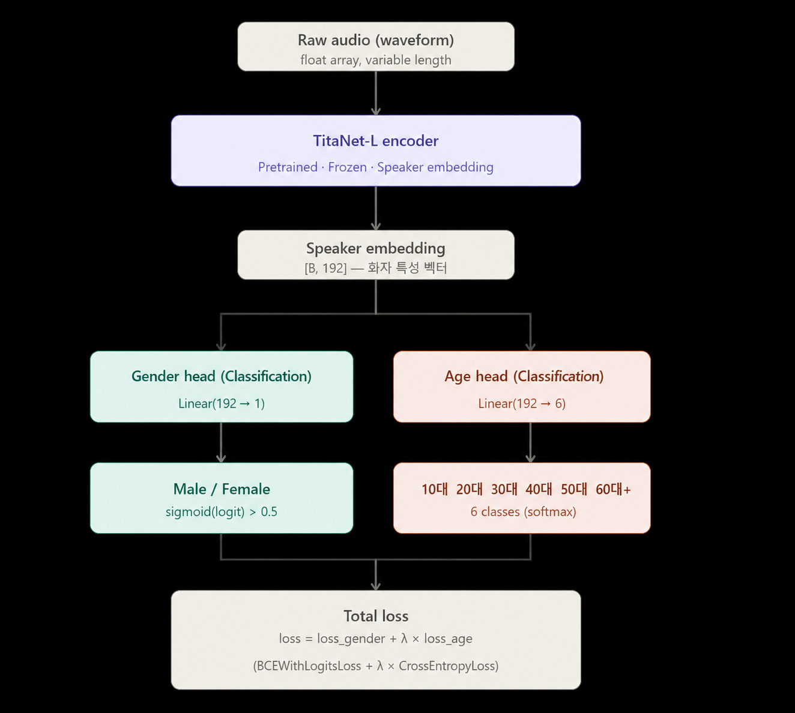
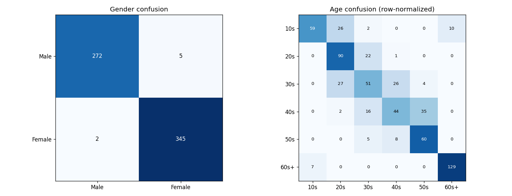

# VoxProfile

*[English README](README.en.md)*

짧은 음성 클립 하나로 화자의 **성별**과 **연령대**를 예측하는 모델입니다.
사전학습된 화자 임베딩 인코더(TitaNet-L) 위에 가벼운 분류 헤드 두 개를
얹어, 하나의 forward pass로 두 속성을 동시에 예측합니다.

- 성별: 이진 분류 (`Male` / `Female`)
- 연령대: 6단계 분류 (`10대` `20대` `30대` `40대` `50대` `60대+`)

## 모델 구조



1. 원본 waveform을 사전학습된 **TitaNet-L** 화자 인식 인코더에 통과시켜
   192차원 화자 임베딩을 추출합니다 (기본값: encoder freeze, 필요 시
   상위 레이어 unfreeze 또는 LoRA로 부분 fine-tuning).
2. 임베딩을 두 개의 독립적인 MLP 헤드(`FlexHead`)에 넣어 각각
   성별 logit(1개)과 연령대 logit(6개)을 출력합니다. 헤드 깊이는
   `light`(직결 Linear) / `medium` / `heavy` 세 프리셋 중 선택합니다.
3. 두 loss를 가중합해 함께 학습합니다:
   `loss = BCEWithLogitsLoss(gender) + λ × CrossEntropyLoss(age)`
   (2-phase 스케줄로 λ와 encoder unfreeze 시점을 조절, `TrainConfig` 참고)

## 성능

`runs/2026_05_21` 체크포인트 기준, 테스트셋 624개 샘플 평가 결과입니다.

| 지표 | 값 |
|---|---|
| 성별 정확도 | 98.9% (277/277 M, 347/347 F 중 오분류 7건) |
| 연령대 12-class joint accuracy (성별+연령대 모두 정답) | 68.8% |

연령대별 세부 지표 (MAE는 실제 연령대와 예측 연령대의 decade 인덱스 차이):

| 연령대 | n | MAE | decade acc |
|---|---:|---:|---:|
| 10대 | 97 | 0.825 | 60.8% |
| 20대 | 113 | 0.212 | 79.6% |
| 30대 | 108 | 0.565 | 47.2% |
| 40대 | 97 | 0.567 | 45.4% |
| 50대 | 73 | 0.247 | 82.2% |
| 60대+ | 136 | 0.257 | 94.9% |



성별 오분류는 거의 없고(0.2% 미만), 연령대는 인접한 decade와 혼동되는
경향이 뚜렷합니다(예: 30↔40대, 20↔30대). 반대로 극단 연령대인 10대와
60대+는 상대적으로 잘 분리됩니다.

## 학습 데이터

AIHub에 공개된 한국어 음성 데이터셋들(자유대화, 회의 음성, 화자인식용
음성 등)에서 성별·연령대 라벨이 있는 발화를 추출·정제해 화자 단위로
train/val/test로 분할했습니다. 데이터 전처리 파이프라인 자체는 내부
경로에 강하게 결합되어 있어 이 저장소에는 포함하지 않았습니다.

## 매니페스트 포맷 (JSONL)

`voxprofile/dataset.py`는 다음 형식의 JSONL 매니페스트를 입력으로 받습니다.
한 줄에 발화 하나:

```json
{"audio": "/path/a.wav", "gender": "male",   "age": "30대"}
{"audio": "/path/b.wav", "gender": "female", "age": "20대"}
```

## 설치

```bash
pip install -r requirements.txt
```

`voxprofile/model.py`는 NeMo(`nemo_toolkit[asr]`)를 통해 TitaNet-L
인코더를 불러옵니다. HuggingFace/NGC 모델명 또는 로컬 `.nemo` 체크포인트
경로를 사용할 수 있으며, `TrainConfig.encoder_name`에서 설정합니다.

## 사용법

저장소 루트에서 모듈 형태로 실행합니다 (`voxprofile`은 패키지입니다):

```bash
# 매니페스트 전체에 대해 체크포인트 평가
python -m voxprofile.evaluate --ckpt runs/2026_05_21/best_model.pt --manifest path/to/test.jsonl

# 단일 오디오 파일 추론
python -m voxprofile.evaluate --ckpt runs/2026_05_21/best_model.pt --audio path/to/sample.wav

# 테스트셋 클래스별 혼동행렬 / MAE 분석
python -m voxprofile.analyze_test --ckpt runs/2026_05_21/best_model.pt --manifest path/to/test.jsonl
```

하이퍼파라미터(경로, 배치 크기, 학습률, LoRA, epoch 등)는
`voxprofile/config.py`(`TrainConfig`)에서 설정합니다. 헤드 크기는
`TrainConfig.model_size = "light" | "medium" | "heavy"`로 선택합니다.

## 프로젝트 구조

```
voxprofile/
├── config.py         TrainConfig (하이퍼파라미터, 경로) + MODEL_CONFIGS 프리셋
├── model.py           LoRA 래퍼, FlexHead (MLP), AgeGenderModel
├── dataset.py          JSONL 매니페스트 Dataset, collate_fn, DataLoader 빌더
├── evaluate.py          체크포인트 평가 / 단일 파일 추론
└── analyze_test.py       클래스별 혼동행렬 / MAE 분석

assets/               README용 다이어그램·성능 지표 이미지
requirements.txt
```

참고: 데이터 매니페스트, 모델 체크포인트, 실험 결과물(`runs/`)은
이 저장소에 포함되지 않습니다 (`.gitignore` 참고).

## 라이선스

[MIT](LICENSE)
